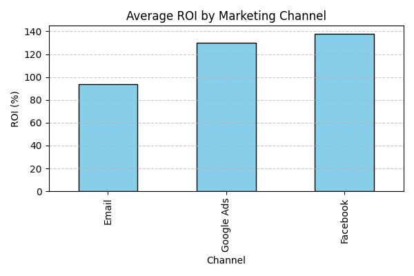
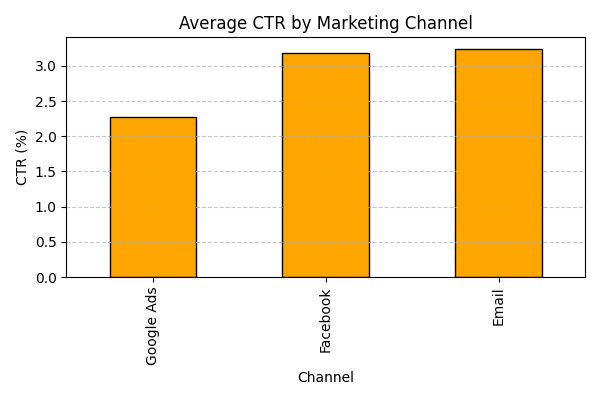
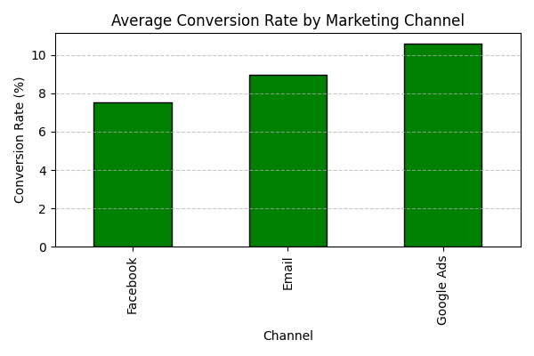

# Marketing Campaign Effectiveness (Portfolio Project)

A complete, ready-to-run portfolio project for Data Analyst roles. It compares **multi‑channel marketing performance** (Facebook, Google Ads, Email) with KPIs like **ROI%**, **CTR%**, **Conversion Rate%**, and **Cost per Conversion**.

## 🚀 What's inside
- `data/marketing_campaign_effectiveness.csv` — dummy dataset
- `powerbi/` — Power Query (M), DAX measures, and theme to build a PBIX quickly
- `analytics/analysis.py` — Python script to compute metrics and save charts
- `app.py` — Streamlit app (for Hugging Face Spaces)
- `images/` — sample charts for the README/LinkedIn
- `LICENSE`, `.gitignore`

## 📊 KPIs
- **ROI%** = (Revenue - Spend)/Spend
- **CTR%** = Clicks/Impressions
- **Conversion Rate%** = Conversions/Clicks
- **Cost per Conversion** = Spend/Conversions

## 🔗 Live Demo (Hugging Face Spaces)
https://huggingface.co/spaces/bernadlein/marketing-campaign-effectivenessv2

## 📷 Preview




## 🧩 Folder structure
```
marketing-campaign-effectiveness/
├── app.py
├── analytics/
│   └── analysis.py
├── data/
│   └── marketing_campaign_effectiveness.csv
├── images/
│   ├── roi_by_channel.png
│   ├── ctr_by_channel.png
│   └── conversion_rate_by_channel.png
├── powerbi/
│   ├── power_query_m_script.pq
│   ├── powerbi_measures.dax
│   └── powerbi_theme.json
├── requirements.txt
├── .gitignore
├── LICENSE
└── README.md

## 📊 KPIs
- **ROI%** = (Revenue - Spend)/Spend
- **CTR%** = Clicks/Impressions
- **Conversion Rate%** = Conversions/Clicks
```
## PORTOFOLIO BY BERNADUS BOLI
## Leinsgreenadz@gmail.com

